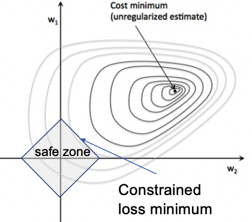
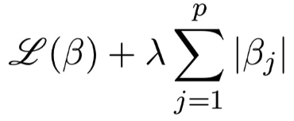
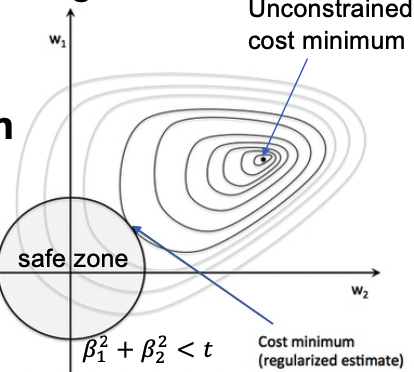
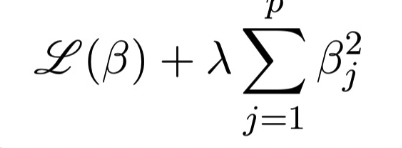
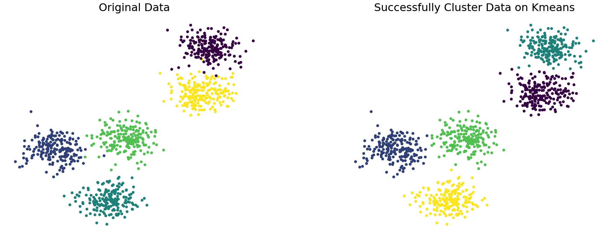
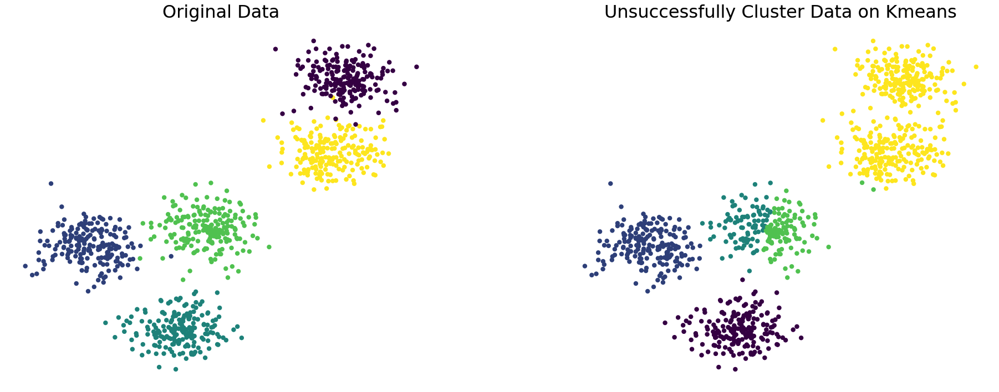
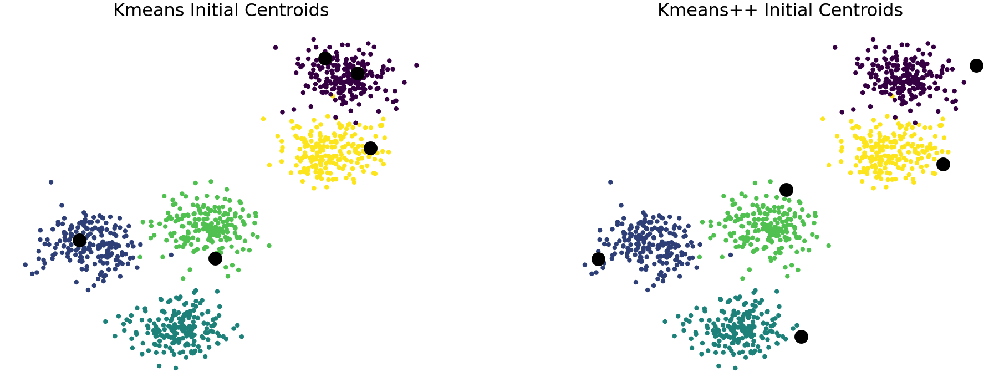
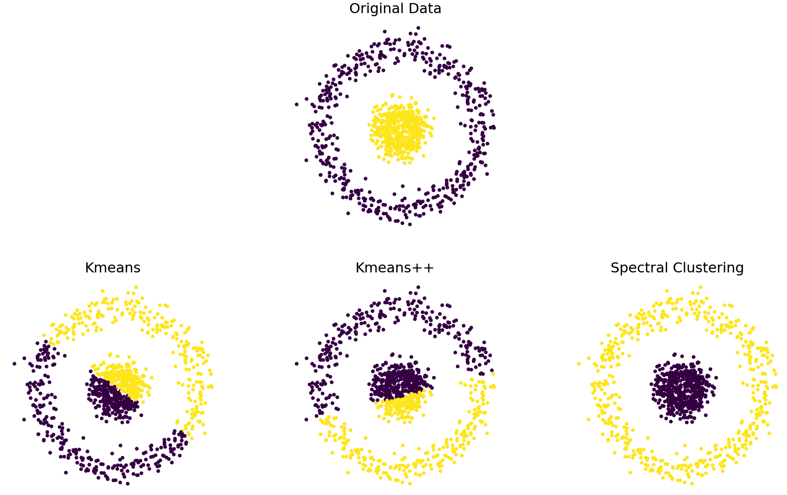
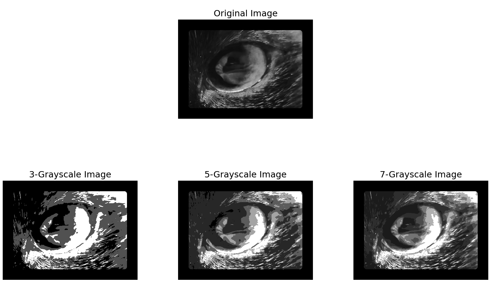
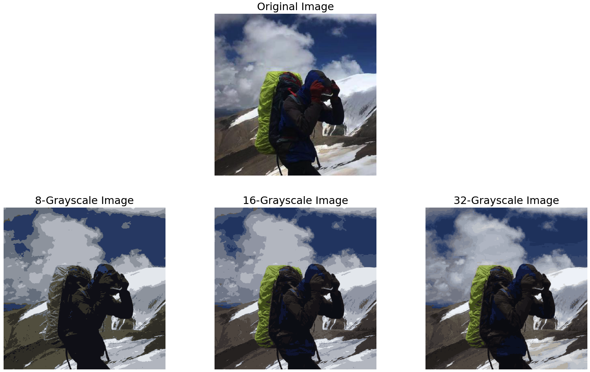

# Machine Learning Implementation from scratch

In this repo, I will show the theory of different models, including supervised learning and unsupervised learning, and implement these models from scratch.

Thanks for Prof. Terence Parr's guidance.

## Supervised Learning Algorithm

Supervised learning is a subcategory of machine learning which learns from labeled training data, helps you to predict outcomes for unforeseen data. It means some data is already tagged with the correct answer and seems like in the presence of a supervisor or a teacher.

## Regularization

Motivation for [regularization](https://github.com/ajinChen/machine-learning-from-scratch/blob/main/LinearRegularization/linreg.py):

1. Model with too many parameters will overfit
2. Outliers can skew line and cause bad generalization
3. Data with too many features can get extreme coefficients

Regularization using the constraint on the average magnitude of the coefficients to bring slope back down but with some bias.

### L1 (Lasso) Regularization

L1 regularization adds the sum of the absolute value of the coefficient to loss function which help reduce model complexity and improve generality. The L1 regularized coefficients located on the diamond-shaped zone has below pros:

1. L1 regularization allows superfluous coefficients to shrink to zero  
2. L1 regularization can reduce the number of features and select features



```python
class LassoLogistic:
    def __init__(self,
                 eta=0.00001, lmbda=0.0,
                 max_iter=1000):
        self.eta = eta
        self.lmbda = lmbda
        self.max_iter = max_iter
        ...
```

### L2 (Ridge) Regularization

L2 regularization adds the sum of the square of the parameters into the loss function which also help reduce model complexity and improve generality. The L2 regularized coefficients located on the circle-shaped zone has below pros: 

1. L2 regularization tends to shrink coefficients evenly  
2. L2 regularization useful when you have collinear/codependent features since L2 regularization will reduce the variance of these coefficient estimates



```python
class RidgeRegression:
    def __init__(self,
                 eta=0.00001, lmbda=0.0,
                 max_iter=1000, y_mean=0):
        self.eta = eta
        self.lmbda = lmbda
        self.max_iter = max_iter
        self.y_mean = y_mean
    	...
```

#### Key Conclusion for Regularization:

1. Regularization increases generality at cost of some bias
2. Hard constraint: min-loss is inside safe zone or on zone border
   Soft constraint: penalty discourages bigger parameters
3. L1 encourages zero 𝛽, L1 zero out unpredictive vars
   L2 discourages any 𝛽 from getting much bigger than the others
4. OLS & L2 regularized linear regression have symbolic solutions
   L1 linear regression and L1/L2 logistic regression require iterative solution


## Decision Tree

Decision Tree is a tree-based algorithm which find split point giving least MSE (least residual variance) or least gini impurity (high purity) and partitions feature space into rectangular hypervolumes predicting average / most common y in volume.

#### Design Decision Tree Structure:

`Internal tree node class`: perform feature comparisons and split

```python
class DecisionNode:
    def __init__(self, col, split, lchild, rchild):
        self.col = col
        self.split = split
        self.lchild = lchild
        self.rchild = rchild

    def predict(self, x_test):
        if x_test[self.col] <= self.split:
            return self.lchild.predict(x_test)
        else:
            return self.rchild.predict(x_test)
```

`Leaf node class`: make prediction for rectangular hypervolumes

```python
class LeafNode:
    def __init__(self, y=None, prediction=None):
        self.prediction = prediction

    def predict(self, x_test):
        return self.prediction
```

After node class implementation, we need to define general decision tree class to realize `fit`, `best_split_func`, and `predict` for [RegressionTree & ClassifierTree class](https://github.com/ajinChen/machine-learning-from-scratch/blob/main/DecisionTree/dtree.py)

#### Hyperparameters:

`Max_depth`: Restricts how many splits tree can make preventing tree from getting too specific to training set

`min_samples_leaf`: tree don’t split regions less than min_samples_leaf records

| Pros                                                         | Cons                                       |
| ------------------------------------------------------------ | ------------------------------------------ |
| Avoid inefficiency and the distance metric requirement of kNN | Easy to overfitting and killing generality |
| No need to normalize data                                    |                                            |
| partition (nominal/ordinal) categorical variables by subsets as "regions" |                                            |


## Random Forest

[Random forest](https://github.com/ajinChen/machine-learning-from-scratch/blob/main/RandomForest/rf.py) is a advanced algorithm using the collection of decision trees trained on subset of training data (bootstrapping) and sometimes ignoring features, average or majority vote among trees

#### The key of random forest is adding randomness:

1. Random subset of training data<br>
   Bagging uses bootstrapping: from 𝑛 records, randomly select 𝑛 with replacement

   ```python
   def bootstrap(X, y, size):
       idx = [i for i in range(size)]
       n = size
       X_boot, idx_sample, y_boot = resample(
           X, idx, y, replace=True, n_samples=int(n))
       idx_oob = list(set(idx) - set(idx_sample))
       return X_boot, y_boot, idx_oob
   ```

2. Random subset of features<br>
   `max_features` : Degrade training by forgetting some features exist when making splitting decisions

3. A bag of decision trees<br>
   Give many weaker decision trees to make average predict from them

   ```python
   class RandomForest:
       ...
       def fit(self, X, y):
           """
           Given an (X, y) training set, fit all n_estimators trees to different,       
           bootstrapped versions of the training data.
           """
           rf_list = []
           for i in range(self.n_estimators):
               X_boot, y_boot, oob_idxs = bootstrap(X, y, len(X))
               T = self.tree(oob_idxs)
               rf_list.append(T.fit(X_boot, y_boot))
           self.trees = rf_list
       ...
   ```

4. Out-of-bag (OOB) score<br>
   Use the out-of-bag data of each decision tree as the validation set.

   ```python
   def compute_oob_score(self, X, y):
       n = len(X)
       oob_counts = np.zeros((n,))
       oob_preds = np.zeros((n,))
       for tree in self.trees:
         for idx in tree.oob_idxs:
             leafsizes = len(tree.leaf(X[idx]).y_value())
             oob_preds[idx] += leafsizes * tree.predict(X[idx])
             oob_counts[idx] += leafsizes
       oob_avg_preds = oob_preds[oob_preds != 0] / oob_counts[oob_counts != 0]
       return r2_score(y[oob_counts != 0], oob_avg_preds)
   ```

| Pros                                            | Cons                               |
| ----------------------------------------------- | ---------------------------------- |
| Increase accuracy without a tendency to overfit | Slow and need a lot of computation |

## Naïve Bayes

...

## Adaboost

...

## Gradient Boosting

...

## Matrix Factorization

...


## Unsupervised Learning Algorithm

Unsupervised learning is a group of learning algorithms that can learn patterns or goals from data without labels. Comparing supervised learning, unsupervised learning can avoid 'human in the loop'. It sounds really exciting that the algorithm has 'intelligence' to learn patterns and value from data without the guidance of human domain knowledge, but unsupervised learning still has some issues should deal with:

1. We don't know if the results of unsupervised learning are meaningful since we have no labels.
2. The performance of unsupervised learning is not good as supervised learning.
3. We need to define an internal evaluation function in the algorithm.

However, we still need unsupervised learning to help us in some situations, especially in some pattern recognition problems. In these problems, we may meet:

1. Labels of data are costly and huge human labor would be needed to make data annotation.
2. Labels of data are rare and hard to get (clinics data).
3. We have no idea of the pattern or relationship of data and need the gist of it.

### Clustering

Clustering is one of the main unsupervised learning problems, which needs a clustering algorithm to discover similar sub_groups within the data. Clustering Algorithms can be classified as blow list:

1. Exclusive Clustering, in which data are grouped exclusively.
2. Overlapping Clustering, in which data are grouped inclusively with membership value.
3. Hierarchical Clustering, which sets whole data as one cluster and divides it into different sub_clusters.
4. Probabilistic Clustering, which groups different data by probabilistic approach.

In this repo, I will introduce exclusive clustering algorithms, including Kmean, Kmean++, and spectral clustering to deal with different clustering problems and apply them to image clustering problems.

## K-Means

[K-means](https://github.com/ajinChen/machine-learning-from-scratch/blob/main/Kmeans/kmeans.py) is one simple but powerful unsupervised learning algorithm to solve the clustering problem. It can group whole data into k clusters depending on the similarity of each data depending on the objective function we give. We can implement the Kmeans algorithm following blow steps:

1. Set k as the number of the cluster we want to algorithm
2. Randomly choose k data as initial centroids of cluster
3. Compute the similarity (Euclidean Distance) of each data to k centroids
4. Assign each data into K clusters depending on the most similar cluster
5. Repeat the above 3,4 steps until the centroids are almost no_changed.

Let's make a visualization of K-means on blob data.

```python
centroids, labels = kmeans(X, 5, centroids=None)
fig, ax = plt.subplots(1, 2, figsize=(16, 6))
fig.subplots_adjust(wspace=0.3)
ax[0].scatter(X[:,0], X[:,1], c=y_b, s=10)
ax[1].scatter(X[:,0], X[:,1], c=labels, s=10)
...
plt.show()
```





#### Drawback of Kmeans

Kmeans algorithm is really sensitive to the initial k centroids, if we randomly choose the k centroids, it may give us a different answer of the k cluster. We need to make this algorithm more stable, so we have K-means++.

## K-Means++

Kmeans++ is a more stable unsupervised algorithm to make k clusters prediction, which discards the way of randomly choosing initial k centroids. In Kmeans++, we choose k initial centroids with low similarity with each other by following the below steps:

1. Randomly choose the first centroid.
2. Compute the max similarity (min_distance) from each data to each centroid.
3. Choose the lowest similarity (max_distance) point from above as the next centroid.
4. Repeat above 2, 3 steps until we choose k centroids.

#### Visualize Kmeans and Kmeans++ initial centroids on the blob data

The original data with different color points represent different clusters of points in data. I adopt this data on K-means++ and K-means with k=5 setting and visualize the initial k centroids as block points on the plots.

```python
centroids_k = kmeans_select_centroids(X, 5)
centroids_kplus = kmeans_plus_select_centroids(X, 5)
fig, ax = plt.subplots(1, 2, figsize=(16, 6))
...
```



We can discover that the first plot on Kmeans doesn't work well in choosing the 5 centroids for each cluster of original data. However, the second plot on K-means++ works much better on choosing the 5 centroids for each cluster of original data.

## Spectral Clustering

Now let's try Kmeans and Kmeans++ on concentric circle data, the performance of these methods is really poor which could not identify the clusters in a no_linear way. It is because the objective function we define in the Kmeans and Kmeans++ is distance-based. We need to choose another method that can help us deal with this no-linear cluster problem.
Spectral Clustering is a better choice to deal with this problem, which uses an affinity matrix and a degree matrix to represent the similarity of data. We can implement spectral clustering below steps:

1. Create a distance matrix and transform it into an affinity matrix A.
2. Compute the degree matrix D and Laplacian matrix L = D - A.
3. Use L to find eigenvalues and eigenvectors.
4. Choose k eigenvectors of largest eigenvalues and cluster the data in k-dim space.

Let's make a visualization of Kmeans, Kmeans++, and Spectral Clustering on concentric circle data.

```python
centroids_k, label_k = kmeans(X, 2, centroids=None)
centroids_kplus, label_kplus = kmeans(X, 2, centroids='kmeans++')
label_sp = kmeans(X, 2, centroids='spectral')
fig, ax = plt.subplots(2, 3, figsize=(16, 10))
...
```



## Image Clustering (Application)

Unsupervised learning like K-means can be implemented on image data, which can help us realize image compression and detect the main component of the image.

First, let's make a try on a grayscale image. Since we care about the grayscale value and want the k dominant clusters of the image, we reshape the image pixel data into one-dim with one graysacle value and send it to the Kmeans++ algorithm. Then I set the k value with [3, 5, 7] different values. Let's see the results!

```python
img = np.array(Image.open(Path).convert('L'))
h, w = img.shape
img = np.reshape(img, (-1,1))
images_gray = []
n_group = [3, 5, 7]
for k in n_group:
    X = img.copy()
    centroids, labels = kmeans(X, k=k, centroids='kmeans++', max_iter=30)
    centroids = centroids.astype(np.uint8)
    X = centroids[labels]
    images_gray.append(X.reshape(h,w))
...
```



Second, I make a further try on RGB image. Since we care about the color vector values and want the k dominant color of the image, we reshape the image pixel data into one-dim with one color vector in RGB format and send it to the Kmeans++ algorithm. Then I set the k value with [8, 16, 32] different values and assign the k color vectors back to the image. Let's see the results!

```python
img = np.array(Image.open(Path))
h, w, d = img.shape
img = img.reshape(h * w, d)
images_color = []
n_group = [8, 16, 32]
for k in n_group:
    X = img.copy()
    centroids, labels = kmeans(X, k=k, centroids=None, max_iter=30)
    centroids = centroids.astype(np.uint8)
    X = centroids[labels]
    images_color.append(X.reshape(h,w,d))
...
```


